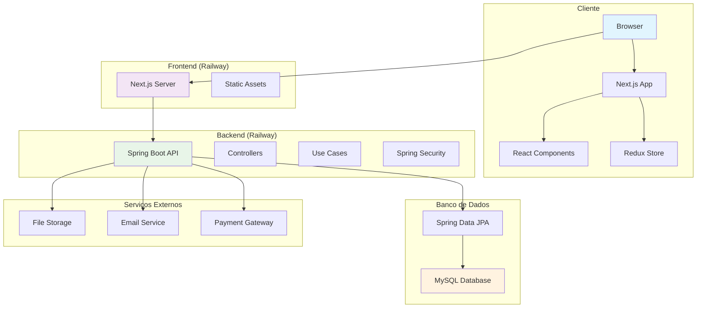

# 🏗️ Arquitetura do Sistema Food Campus

> Documentação técnica detalhada da arquitetura e tecnologias utilizadas no projeto

## 📚 Índice

1. [Visão Geral](#visão-geral)
2. [Tecnologias](#tecnologias)
3. [Componentes](#componentes)
4. [Diagrama da Arquitetura](#diagrama-da-arquitetura)
5. [Fluxo de Dados](#fluxo-de-dados)
6. [Padrões Utilizados](#padrões-utilizados)
7. [Segurança](#segurança)
8. [Deploy e Infraestrutura](#deploy-e-infraestrutura)

## 🎯 Visão Geral

O Food Campus segue uma arquitetura **cliente-servidor** moderna, com separação clara entre frontend e backend. O sistema foi projetado para ser escalável, manutenível e seguir as melhores práticas de desenvolvimento web.

### 🏛️ Princípios Arquiteturais

- **Separação de Responsabilidades**: Frontend e backend independentes
- **API-First**: Backend expõe APIs REST bem documentadas
- **Componentização**: Frontend modular com componentes reutilizáveis
- **Escalabilidade**: Arquitetura preparada para crescimento
- **Manutenibilidade**: Código limpo e bem documentado

## 🛠️ Tecnologias

### 🖥️ Frontend

| Tecnologia | Versão | Propósito |
|------------|--------|-----------|
| **React.js** | 18.x | Biblioteca para construção de interfaces SPA |
| **Next.js** | 14.x | Framework web baseado em React com SSR |
| **TypeScript** | 5.x | Superset do JavaScript com tipagem estática |
| **Tailwind CSS** | 3.x | Framework utilitário para estilização |
| **Shadcn UI** | Latest | Biblioteca de componentes UI modernos |
| **Redux Toolkit** | 2.x | Gerenciamento de estado global |
| **React Query** | 5.x | Gerenciamento de estado do servidor |

### 🔧 Backend

| Tecnologia | Versão | Propósito |
|------------|--------|-----------|
| **Java** | 17 | Linguagem de programação principal |
| **Spring Boot** | 3.5.3 | Framework para criação de APIs REST |
| **Spring Data JPA** | 3.x | Abstração para acesso a dados |
| **Spring Security** | 6.x | Autenticação e autorização |
| **MySQL** | 8.x | Banco de dados relacional |
| **MapStruct** | 1.6.3 | Mapeamento entre objetos Java |
| **Lombok** | Latest | Redução de boilerplate no código |

### 🗄️ Banco de Dados

| Tecnologia | Versão | Propósito |
|------------|--------|-----------|
| **MySQL** | 8.x | Banco de dados principal |
| **Spring Data JPA** | 3.x | ORM e gerenciamento de entidades |
| **Hibernate** | 6.x | Implementação JPA (através do Spring Data) |

## 🧩 Componentes

### 📱 Frontend (Next.js)

```
src/
├── components/          # Componentes reutilizáveis
│   ├── ui/             # Componentes base (Shadcn)
│   ├── forms/          # Formulários
│   └── layout/         # Componentes de layout
├── pages/              # Páginas da aplicação
│   ├── api/            # API routes (Next.js)
│   ├── auth/           # Páginas de autenticação
│   ├── products/       # Páginas de produtos
│   └── profile/        # Páginas de perfil
├── hooks/              # Custom hooks
├── services/           # Serviços de API
├── store/              # Estado global (Redux)
├── types/              # Definições TypeScript
└── utils/              # Utilitários
```

### ⚙️ Backend (Spring Boot)

```
src/main/java/com/ps/foodcampus/
├── adapters/              # Camada de adaptadores (portas de entrada e saída)
│   ├── controller/        # Controladores REST (portas de entrada)
│   ├── entity/            # Entidades JPA e DTOs
│   │   ├── mapper/        # Mapeadores entre camadas
│   │   ├── request/       # DTOs de requisição
│   │   └── response/      # DTOs de resposta
│   └── repository/        # Repositórios JPA (portas de saída)
│       └── impl/          # Implementações dos repositórios
├── application/           # Camada de aplicação (casos de uso)
│   ├── exceptions/        # Exceções de negócio
│   ├── usecase/           # Casos de uso e regras de negócio
│   │   └── impl/          # Implementações dos casos de uso
│   └── utils/             # Utilitários de validação
├── domain/                # Camada de domínio (entidades e regras)
│   ├── dto/               # DTOs de domínio
│   ├── mapper/            # Mapeadores de domínio
│   └── model/             # Modelos de domínio
├── infra/                 # Camada de infraestrutura
│   └── db/                # Configurações de banco de dados
└── FoodcampusApplication.java # Classe principal Spring Boot
```

## 🏗️ Diagrama da Arquitetura



## 🔄 Fluxo de Dados

### 1. **Autenticação**
```
Cliente → Frontend → Backend → Database
   ↑         ↓         ↓         ↓
   ←─────────←─────────←─────────←
```

### 2. **Busca de Produtos**
```
Cliente → Frontend → Backend → Database
   ↑         ↓         ↓         ↓
   ←─────────←─────────←─────────←
```

### 3. **Criação de Pedido**
```
Cliente → Frontend → Backend → Database
   ↑         ↓         ↓         ↓
   ←─────────←─────────←─────────←
```

## 🎨 Padrões Utilizados

### 🏗️ Padrões de Arquitetura

- **Clean Architecture (Hexagonal)**: Separação clara de responsabilidades em camadas
- **Dependency Inversion**: Dependências apontam para abstrações
- **Repository Pattern**: Abstração do acesso a dados
- **Use Case Pattern**: Casos de uso isolados com regras de negócio
- **DTO Pattern**: Transfer objects para comunicação entre camadas

### 📝 Padrões de Código

- **SOLID Principles**: Princípios de design orientado a objetos
- **DRY (Don't Repeat Yourself)**: Evitar duplicação de código
- **MapStruct**: Mapeamento automático entre objetos
- **Lombok**: Redução de boilerplate com anotações
- **Spring Boot Conventions**: Convenções do framework Spring

## 🔒 Segurança

### 🛡️ Medidas Implementadas

- **Spring Security**: Framework de segurança robusto e configurável
- **JWT Authentication**: Tokens seguros para autenticação
- **Password Hashing**: Senhas criptografadas com BCrypt (Spring Security)
- **CORS**: Configuração adequada para requisições cross-origin
- **Input Validation**: Validação de dados com Bean Validation (JSR-303)
- **SQL Injection Protection**: Uso de Spring Data JPA com prepared statements

### 🔐 Práticas de Segurança

- **HTTPS**: Comunicação criptografada
- **Environment Variables**: Configurações sensíveis em variáveis de ambiente
- **Rate Limiting**: Proteção contra ataques de força bruta
- **Input Sanitization**: Limpeza de dados de entrada com Spring Security

## 🚀 Deploy e Infraestrutura

### ☁️ Plataformas de Deploy

| Serviço | Propósito | URL |
|---------|-----------|-----|
| **Railway** | Frontend (Produção) | https://foodcampusfrontend-production.up.railway.app/ |
| **Railway** | Backend (Produção) | Em desenvolvimento |
| **GitHub** | Versionamento | https://github.com/vmedei/foodcampus_* |

### 🔧 Configuração de Ambiente

#### Frontend
```bash
# Variáveis de ambiente
NEXT_PUBLIC_API_URL=https://api.foodcampus.com
NEXT_PUBLIC_APP_URL=https://foodcampus.com
```

#### Backend
```properties
# Configuração do Spring Boot (application.properties)
spring.application.name=foodcampus
spring.datasource.url=jdbc:mysql://localhost:3306/foodcampus
spring.datasource.username=root
spring.datasource.password=password
spring.jpa.hibernate.ddl-auto=update
spring.jpa.show-sql=true
server.port=8080
jwt.secret=your-secret-key
```

### 📊 Monitoramento

- **Logs**: Railway logs para debugging
- **Performance**: Monitoramento de performance via Railway
- **Uptime**: Verificação de disponibilidade
- **Errors**: Captura e análise de erros

---

## 📈 Roadmap Técnico

### 🎯 Próximas Implementações

- [ ] **Spring Security JWT**: Implementação completa de autenticação
- [ ] **Swagger/OpenAPI**: Documentação automática da API
- [ ] **Redis Cache**: Implementação de cache com Spring Cache
- [ ] **Docker**: Containerização da aplicação
- [ ] **CI/CD**: Pipeline automatizado de deploy
- [ ] **Spring Boot Actuator**: Monitoramento e métricas

### 🔮 Melhorias Futuras

- [ ] **WebSockets**: Comunicação em tempo real com Spring WebSocket
- [ ] **PWA**: Progressive Web App
- [ ] **Mobile App**: Aplicativo nativo
- [ ] **Spring Cloud**: Microserviços com Spring Cloud
- [ ] **TestContainers**: Testes de integração com banco real

---

> **Última atualização**: Dezembro 2024  
> **Responsável**: Equipe de Desenvolvimento Food Campus
