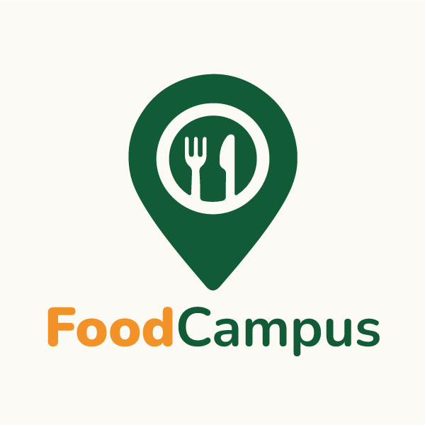
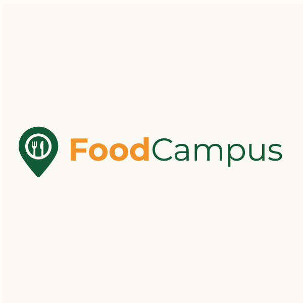
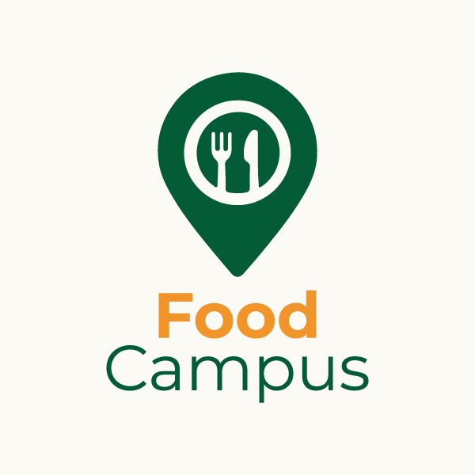
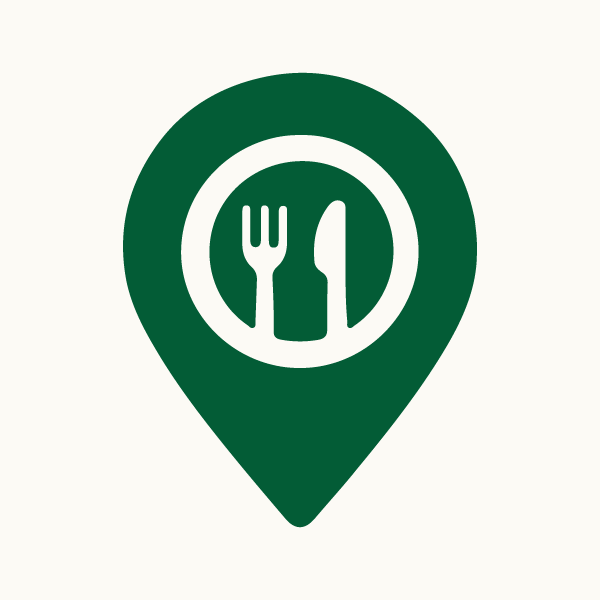
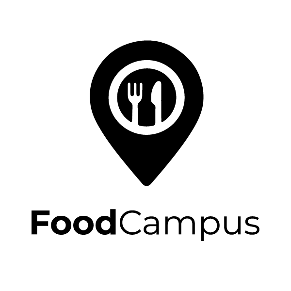
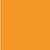
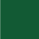
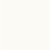

# 🎨 Identidade Visual - Food Campus

> Manual de identidade visual e diretrizes de design para o projeto Food Campus

## 🎯 Visão Geral

O Food Campus é uma plataforma que conecta estudantes e ambulantes no ambiente universitário. Nossa identidade visual reflete **modernidade**, **acessibilidade** e **comunidade**, criando uma experiência visual coesa e convidativa.

### 🏛️ Princípios de Design

- **Simplicidade**: Design limpo e intuitivo
- **Acessibilidade**: Cores e contrastes adequados para todos
- **Consistência**: Elementos visuais coerentes em todas as plataformas
- **Modernidade**: Visual contemporâneo e atrativo
- **Comunidade**: Sensação de pertencimento e conexão

---

## 🏷️ Logotipo

### 📐 Logotipo Principal



### 🔄 Variações do Logotipo

#### Versão Horizontal


#### Versão Vertical


#### Versão Símbolo


#### Versão Monocromática


---

## 🌈 Paleta de Cores

### 🎨 Cores Primárias

#### Laranja Principal
- **Hex**: `#F39727`
- **RGB**: `243, 151, 39`



#### Verde Secundário
- **Hex**: `#065A34`
- **RGB**: `9, 90, 52`



### 🎨 Cores Neutras

#### Off-White
- **Hex**: `#FCFAF5`
- **RGB**: `252, 250, 245`



#### Branco
- **Hex**: `#FFFFFF`
- **RGB**: `255, 255, 255`

### 🎨 Cores de Status

#### Vermelho (Erro)
- **Hex**: `#E74C3C`
- **RGB**: `231, 76, 60`
- **Uso**: Erros, alertas, ações destrutivas

#### Amarelo (Aviso)
- **Hex**: `#F39C12`
- **RGB**: `243, 156, 18`
- **Uso**: Avisos, informações importantes

#### Azul (Informação)
- **Hex**: `#3498DB`
- **RGB**: `52, 152, 219`
- **Uso**: Informações, links, elementos informativos

---

## 🔤 Tipografia

### 📝 Fonte Principal

**Montserrat** - Para interface digital
- **Uso**: Títulos, subtítulos, textos de interface
- **Pesos**: 400 (Regular), 500 (Medium), 600 (SemiBold), 700 (Bold)
- **Fallback**: -apple-system, BlinkMacSystemFont, "Segoe UI", Roboto, sans-serif

```css
font-family: 'Montserrat', -apple-system, BlinkMacSystemFont, 'Segoe UI', Roboto, sans-serif;
```

### 📝 Fonte Secundária

**Open Sans** - Para elementos de destaque
- **Uso**: Logotipo, títulos principais, elementos especiais
- **Pesos**: 400 (Regular), 500 (Medium), 600 (SemiBold), 700 (Bold)

```css
font-family: 'Open Sans', sans-serif;
```